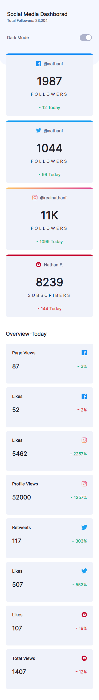
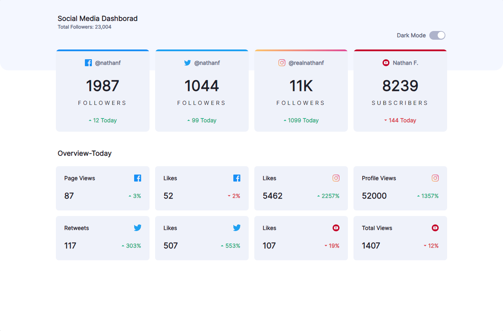

# Frontend Mentor - Social media dashboard with theme switcher solution

This is a solution to the [Social media dashboard with theme switcher challenge on Frontend Mentor](https://www.frontendmentor.io/challenges/social-media-dashboard-with-theme-switcher-6oY8ozp_H). Frontend Mentor challenges help you improve your coding skills by building realistic projects. 

## Table of contents

- [Overview](#overview)
  - [The challenge](#the-challenge)
  - [Screenshot](#screenshot)
  - [Links](#links)
- [My process](#my-process)
  - [Built with](#built-with)
  - [What I learned](#what-i-learned)
  - [Continued development](#continued-development)
  - [Useful resources](#useful-resources)
- [Author](#author)

## Overview

Es un reto tomado en la pagina de frontendmentor, el cual consiste en hacer un dasboard donde se muestre las actividades de los usuario
It is a challenge taken on the frontendmentor page, which consists of making a dashboard where the user's activities are shown.

### The challenge

Users should be able to:

- View the optimal layout for the site depending on their device's screen size
- See hover states for all interactive elements on the page
- Toggle color theme to their preference

### Screenshot

### Links

- Solution URL: [git Hub](https://github.com/cyeguez/Social-media-dashboard-with-theme-switcher-solution)
- Live Site URL: [Git Pages](https://cyeguez.github.io/Social-media-dashboard-with-theme-switcher-solution/)

## My process

 1. Start by defining the semantic tags of the 2.project.
 2. Define the variables.
 3. Write CSS styles.
 4. Develop logic in CSS.

### Built with

## Author

- Frontend Mentor - [@Cesar Yeguez](https://www.frontendmentor.io/profile/cyeguez)
